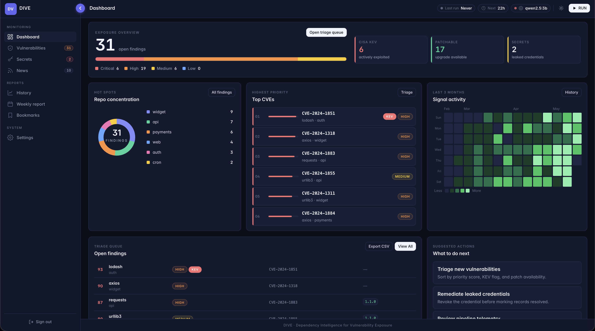

<div align="center">
  <h1>D.I.V.E.</h1>
  <p>Dependency Intelligence for Vulnerability Exposure</p>
</div>

---

A self-hosted security intelligence tool that runs on a Raspberry Pi (or any Linux box). On a configurable schedule it collects newly published security news, categorises it with a local AI model, scans your GitHub repositories for known CVEs and secrets, then sends delta alerts to Slack, Discord, or email — all without any paid APIs or cloud services.


*(sample screenshot of the dashboard)*

---

## What it does

| Step | What happens |
|------|-------------|
| **Collect** | Fetches security news from RSS feeds, NVD, CISA KEV, and GitHub Security Advisories into a local database |
| **Categorise** | Uses a local Ollama model to label each item by category, severity, and CVE cluster; items that fail categorisation are retried up to 3 times |
| **Scan** | Parses every dependency manifest in your GitHub repos and queries OSV.dev in 500-item batches for known vulnerabilities |
| **Issue creation** | Optionally creates `[Security]`-prefixed GitHub issues for new findings with deduplication against existing open issues |
| **Secrets** | Runs gitleaks over shallow repo clones to detect committed secrets; false positives can be suppressed permanently |
| **Lifecycle** | Reconciles finding states after each scan — auto-resolves findings that have disappeared, and re-opens any that have regressed |
| **Alert** | Sends delta notifications (new findings only) to Slack, Discord, or email; channels are independent |
| **Dashboard** | Serves a web UI at `:8000` for browsing news, triaging findings, managing settings, and reviewing history |

---

## Requirements

- **Docker** and **Docker Compose** (V2)
- A machine with at least **4 GB RAM** (8 GB recommended for larger models)
- A **GitHub fine-grained PAT** with *Contents: Read-only* and *Metadata: Read-only* scopes
- Internet access for the first model pull (~2 GB); subsequent runs work fully offline
- `gitleaks` v8.18.4 — included automatically in the Docker image (multi-arch: amd64, arm64, armv7)

Tested on Raspberry Pi 4 (8 GB) running Raspberry Pi OS Bookworm 64-bit, and on macOS/Linux x86-64.

---

## Quick start

```bash
# 1. Clone
git clone https://github.com/bladzv/dive.git
cd dive

# 2. Configure
cp config.yaml.example config.yaml
chmod 600 config.yaml
nano config.yaml          # fill in github.token, github.username, dashboard.password,
                          # and at least one notification channel

# 3. Start
docker compose up -d

# 4. Pull the AI model (first time only — ~2 GB)
docker compose exec ollama ollama pull qwen2.5:3b

# 5. Open the dashboard
open http://localhost:8000   # log in with dashboard.username / dashboard.password
                             # then click ▶ Run Now to trigger the first scan
```

> **Accessing from another device on the same network?** Replace `localhost` with the host machine's local IP address (e.g. `http://192.168.1.x:8000`). Run `hostname -I` (Linux/Pi) or `ipconfig getifaddr en0` (Mac) on the host to find it. Docker already listens on all interfaces — no extra config needed. For remote access outside your network, see [`docs/tailscale-setup.md`](docs/tailscale-setup.md).

---

## Features

- **Zero paid dependencies** — all AI inference runs locally via [Ollama](https://ollama.com)
- **Vulnerability deduplication** — findings are deduplicated across runs; only net-new vulnerabilities trigger alerts
- **KEV enrichment** — findings are cross-referenced with the CISA Known Exploited Vulnerabilities catalogue
- **Priority scoring** — CVSS × 6 + KEV bonus + patch-availability penalty, clamped to 0–100
- **Finding lifecycle** — New → Acknowledged → Resolved state machine with automatic resolution and regression detection
- **Manifest coverage** — `requirements.txt`, `Pipfile`, `pyproject.toml`, `package.json`, `package-lock.json`, GitHub Actions workflows
- **Secrets scanning** — gitleaks-based scanning of shallow repo clones with permanent false-positive suppression
- **GitHub issue auto-creation** — optional step that opens `[Security]`-prefixed issues in affected repos with deduplication against existing open issues
- **AI next steps** — optional Ollama-powered remediation suggestions attached to each finding
- **Multi-channel notifications** — Slack (Block Kit), Discord, and SMTP email; a failure on one channel never blocks others
- **Weekly digest** — auto-generated Monday morning summary of top findings, resolution stats, and most-affected repos; dispatched to all configured channels
- **Bookmarks** — bookmark any news item from the dashboard and revisit them on the Personal page
- **Annotations** — add free-text notes to any finding; visible inline in the findings table
- **Data export** — download all findings or news items as JSON or CSV from the Personal page
- **History view** — stacked-bar charts of news volume and new findings per day, source reliability table, and pipeline run log with a configurable day window (7 / 14 / 30 / 90)
- **Feed analytics** — per-source item counts charted over time with a summary totals table
- **Configurable schedule** — 3 h, 6 h, 12 h, 24 h, or a custom value; changeable from the Settings page without restarting
- **Model switching** — select any installed Ollama model from Settings; install commands shown inline for models not yet pulled
- **Dark mode** — system-preference aware with a manual toggle; preference persisted in `localStorage`
- **Concurrent-run protection** — file-based lock prevents overlapping pipeline runs across processes
- **CSRF protection** — Run Now button requires a per-deployment token stored in the database

---

## Configuration

All secrets live in `config.yaml` (never committed). Copy the example and fill in your values:

```bash
cp config.yaml.example config.yaml
chmod 600 config.yaml
```

The minimum required fields:

```yaml
github:
  token: "github_pat_..."   # fine-grained PAT, 90-day expiry
  username: "your-username"

dashboard:
  password: "choose-a-strong-password"

notifications:
  slack:
    webhook_url: "https://hooks.slack.com/services/..."  # or discord / email
```

Runtime preferences (scan interval, active model, feature toggles, RSS feeds, keyword watchlist, scanner settings) are managed through the **Settings** page and stored in the SQLite database — no file edits or restarts needed.

See [`config.yaml.example`](config.yaml.example) for all options and inline documentation.

---

## Documentation

| Guide | What it covers |
|-------|----------------|
| [`docs/setup.md`](docs/setup.md) | Overview of all setup paths and guides |
| [`docs/raspberry-pi-setup.md`](docs/raspberry-pi-setup.md) | Preparing a fresh Pi: OS, Docker, firewall, SSH hardening |
| [`docs/docker-setup.md`](docs/docker-setup.md) | Running with Docker Compose; updating; backups |
| [`docs/tailscale-setup.md`](docs/tailscale-setup.md) | Remote access from any device via Tailscale |
| [`docs/mac-preparation.md`](docs/mac-preparation.md) | Getting your GitHub PAT and notification webhook URLs |
| [`docs/models.md`](docs/models.md) | Choosing an Ollama model; trade-offs for Pi vs. larger hardware |

---

## Tech stack

| Layer | Technology |
|-------|-----------|
| Web framework | [FastAPI](https://fastapi.tiangolo.com) + [uvicorn](https://www.uvicorn.org) |
| Scheduler | [APScheduler](https://apscheduler.readthedocs.io) 3.x (in-process) |
| Database | SQLite with WAL mode ([`db.py`](dive/db.py)) |
| AI inference | [Ollama](https://ollama.com) — local, no GPU required |
| HTTP client | [httpx](https://www.python-httpx.org) |
| GitHub API | [PyGitHub](https://pygithub.readthedocs.io) |
| Vulnerability data | [OSV.dev](https://osv.dev) batch API (free, no key needed) |
| News sources | RSS/Atom via [feedparser](https://feedparser.readthedocs.io), NVD REST API, CISA KEV JSON, GitHub Security Advisories |
| Secrets scanning | [gitleaks](https://github.com/gitleaks/gitleaks) v8.18.4 (multi-arch binary, bundled in Docker image) |
| Charts | [Chart.js](https://www.chartjs.org) 4 (CDN, no build step) |
| Templates | [Jinja2](https://jinja.palletsprojects.com) — server-side HTML, no build step |
| Containerisation | Docker + Docker Compose |

---

## Development

```bash
# Install dependencies
python -m venv .venv && source .venv/bin/activate
pip install -r requirements.txt -r requirements-dev.txt

# Run the app locally (needs config.yaml and Ollama running)
uvicorn dive.main:app --reload --port 8000

# Run tests (no network or Ollama needed)
pytest tests/ --ignore=tests/integration -v

# Integration tests (require live GitHub token and Ollama)
pytest tests/integration/ -v

# Lint and format
ruff check . && black --check .

# Dependency audit
pip-audit -r requirements.txt
```

Tests live in `tests/` (unit) and `tests/integration/` (live network — skipped in CI). The `DB_PATH` environment variable overrides the database path in tests to avoid writing to `data/`.

---

## CI

On every push or pull request to `main`: ruff → black check → pip-audit → pytest unit tests → Docker build. See [`.github/workflows/ci.yml`](.github/workflows/ci.yml).

Releases are built via [`.github/workflows/release.yml`](.github/workflows/release.yml): tagging `v*` triggers a multi-arch Docker image push to `ghcr.io` (linux/amd64 + linux/arm64) and a GitHub Release with the matching CHANGELOG excerpt.

---

## License

MIT — see [`LICENSE`](LICENSE).
